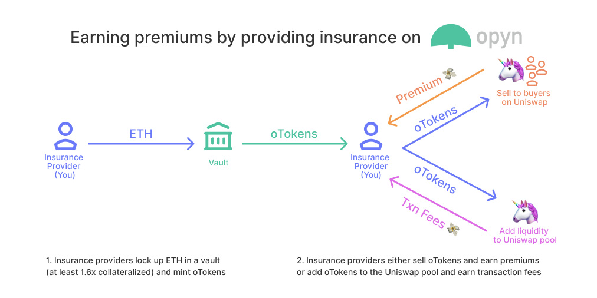
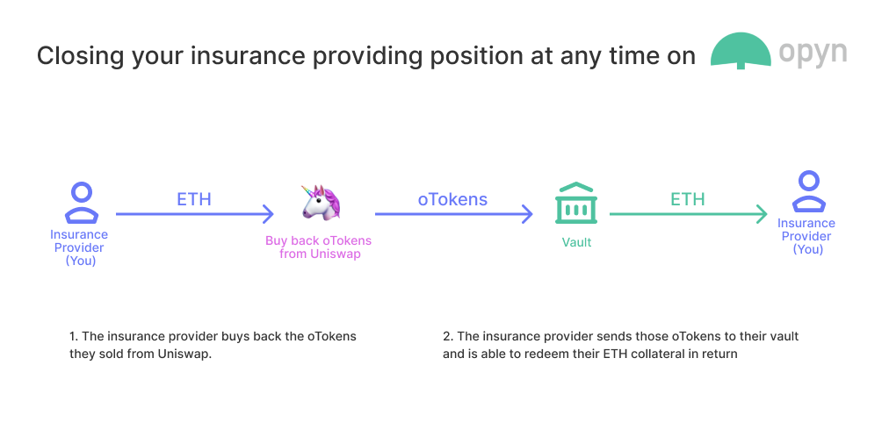
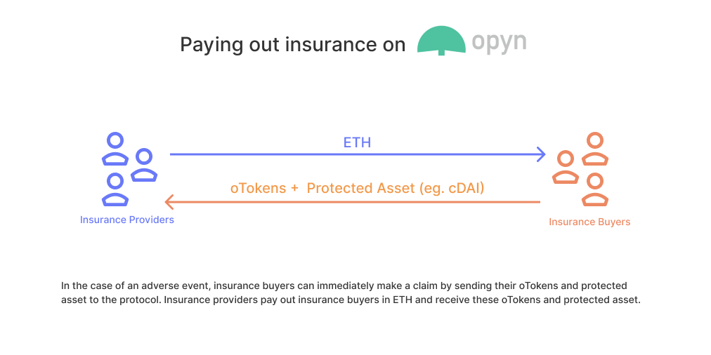

# FAQ

Opyn is building the insurance layer for DeFi. This is the first platform protecting users in DeFi against both technical and financial risks, starting with Compound deposit insurance. The platform is a two-sided marketplace designed using put options on the Convexity Protocol \(convexity.opyn.co\). Opyn also allows ETH holders to earn meaningful premiums on their ETH holdings by providing insurance.

If you have any additional questions not covered below, or want to learn more, join the [Opyn Discord](https://discord.gg/2NFdXaE) or email us at [hello@opyn.co](mailto:hello@opyn.co).

## Buying Insurance

### **What DeFi protocols do you currently cover?** 

Opyn currently provides deposit insurance for Compound, specifically DAI and USDC deposits. Based on your [feedback](mailto:hello@opyn.co), we’re looking forward to adding insurance for additional protocols.

### **How is insurance priced?** 

Since insurance contracts are tokenized as oTokens, pricing is determined by the market price of oTokens on Uniswap. Therefore, pricing is completely decentralized as it is market determined based on the supply and demand of insurance at any given point in time.

In the background, insurance is bought and sold using [Uniswap](https://uniswap.exchange/). 

### **What risks are covered?**  

Opyn provides protection against a number of different risks:

* Technical risks \(eg. smart contracts hacks\)
* Financial risks \(eg. liquidity crises\)
* Admin risks \(eg. admin key compromise, governance vulnerabilities\)

Opyn protects against all oracle manipulation with the exception of Compound's ETH:USD oracle, which is used in the protocol. Opyn currently does not protect against non-transferable ERC20 tokens. We are actively working on increasing the surface of risks we can cover for future iterations of the protocol.

### **How do claims work?** 

If there is an issue with your Compound deposit, you can make a claim at any time to receive immediate payout.

Here’s what’s automatically happening in the background: 

1. Send 

   a. You are sending your USDC/DAI on Compound, which is no longer worth it’s full value due to the hack / financial crisis, to the protocol 

   b. You are sending your insurance tokens back to the protocol 

2. Receive 

   a. You immediately receive your insurance payout in ETH  

### **Who is providing insurance?**  

Opyn is built as a two sided marketplace, so any individuals interested in putting down ETH collateral and earning a premium can provide insurance. These positions are overcollateralized with the minimum collateralization ratio of 160%, meaning that there is at least $1.60 locked up for each $1 of insurance coverage. 

### What is "Max Loss"? 

The "max loss" is the maximum loss you can face on the position that you are covering. The rest is covered by your policy. For example, if you are insuring 1000 DAI and the Max Loss is 20 DAI, then in the case of an adverse event if you max a claim, you will receive $980 of ETH. 

## Earning ETH Premiums by Providing Insurance 

### **How can I earn ETH premiums?** 

You can earn ETH premiums by providing insurance. In the background, you are supplying ETH as collateral and then minting oTokens \(insurance tokens\). Then you have have two possibilities to earn money on their ETH. They can either sell oTokens to insurance buyers on Uniswap and earn premiums or add oTokens to the Uniswap Pool and earn transaction fees from other users' trading activity.

### **What does the return profile look like?** 

[**Being a Liquidity Provider on Uniswap**](https://uniswap.exchange/add-liquidity?token=0x98cc3bd6af1880fcfda17ac477b2f612980e5e33)**:** As an LP on Uniswap you earn transaction fees from individuals buying and selling on the Opyn platform through Uniswap and have the opportunity to make a large, but variable, return as a result as long as you remain above 1.6x collateralized \(otherwise you are at risk of liquidation\). Being a Uniswap LP also allows you to remove your funds at any time. [This article explains a bit more about being a Uniswap LP](https://blog.zerion.io/returns-of-holding-vs-defi-ing-c6f050e89c8e).

[**Selling oTokens on Uniswap**](https://uniswap.exchange/swap?inputCurrency=0x98cc3bd6af1880fcfda17ac477b2f612980e5e33)**:** Selling oTokens to insurance buyers on Uniswap allows you to earn premiums on your ETH that far outshine anything you can get currently in DeFi \([currently 0.01% on Compound](https://compound.finance/markets), [0.05% on dYdX](https://trade.dydx.exchange/balances)\), and you will get the entirety of it back as long as you remain above 1.6x collateralized \(otherwise you are at risk of liquidation\) and there isn’t some disaster event \(eg. technical risk like a hack, financial risk like DAI breaking its peg or a run on Compound\). Here you’re taking a similar risk to depositing ETH on Compound, where you earn 0.01% and are exposed to Compound risk. With Opyn, you are exposed to Compound risk and Opyn risk, but earn a significantly higher premium on ETH.

### **What are the risks with earning ETH premiums by providing insurance?** 

Initially you can choose to earn a yield for providing insurance for the following: 

* USDC on Compound - exposing you to USDC, Compound, and Opyn risk 
* DAI on Compound - exposing you to Maker, Compound, and Opyn risk. 

In the case that there is an adverse event affecting the protocols you are exposed to, you may lose some or all of your collateral. 

### **When could I get liquidated?** 

You are required to maintain a minimum collateral ratio of 160%. If you fall below this threshold, you are at risk of liquidation.

### Can I liquidate people? 

Yes, you can check out Opyn's [example liquidator bot here](https://github.com/opynfinance/LiquidatorBot). 

### **What if I want to close my position before the expiry date?**

You can close your position at any time by buying back the oTokens you had sold on Uniswap and returning them to your vault, which would allow you to redeem your ETH collateral. One note is that the price of oTokens could have increased or decreased in the time since you first purchased them.

### **What happens in the case of an adverse event?**

In the case of an adverse event, insurance buyers can make a claim by sending their oTokens and protected asset \(eg. cDAI\) to the protocol. Insurance providers then pay out insurance buyers in ETH and receive these oTokens and protected asset \(eg. cDAI\).

## Integrating your DApp 

### Can I provide insurance for my users? 

Yes! You can allow your users to access Compound deposit insurance directly through your DApp by integrating with the protocol. You can explore the [documentation here](https://opyn.gitbook.io/opyn/insurance-integrations/insurance-buyer-integrations) and chat with us on [Discord](https://discord.gg/2NFdXaE) :\) 

### Can I create my own insurance market? 

Absolutely! The Opyn Convexity protocol is an open protocol that allows anyone to create insurance markets and interfaces on top. We encourage the community to bootstrap markets and interfaces. You can get started with bootstrapping your own marketplace [here](https://opyn.gitbook.io/opyn/options-factory) and chat with us on [Discord](https://discord.gg/2NFdXaE) :\)   
  
As an example, the [iearn.finance](https://iearn.finance/cover) team created a market for [y.curve.fi](https://y.curve.fi/) \(oCRV\) and they host that interface as well. 

## Under the hood 

### What is the Convexity Protocol? 

The Convexity Protocol is the first generalizable, on-chain options protocol on Ethereum. Opyn provides insurance using the Convexity Protocol's protective put options. You can access the convexity protocol whitepaper at [convexity.opyn.co](http://convexity.opyn.co/) and can access the [smart contracts here](https://opyn.gitbook.io/opyn/abis-smart-contract-addresses). 

### Can I build on top of the Convexity Protocol? 

Yes! We are excited to see the all the different applications people will explore with on-chain options. You can find the [documentation here](https://opyn.gitbook.io/opyn/) and chat with us on [Discord](https://discord.gg/2NFdXaE) :\) 

### What are oTokens? 

oTokens are ERC20 tokens that represent the insurance \(protective put option\) that you have bought or sold. Each oToken corresponds to one unit of the insured asset. Eg. 1 ocUSDC protects 1 cUSDC

### Which oTokens are currently available? 

| Name | Underlying Asset | Collateral Asset | Strike Price | Expiry  |
| :--- | :--- | :--- | :--- | :--- |
| [ocDAI ](https://etherscan.io/token/0x98cc3bd6af1880fcfda17ac477b2f612980e5e33) | [cDAI](https://etherscan.io/token/0x5d3a536E4D6DbD6114cc1Ead35777bAB948E3643) | ETH | $0.01859 | 02/10/2021 |
| [ocDAI \(old\)](https://etherscan.io/token/0xddac4aed7c8f73032b388efe2c778fc194bc81ed) | [cDAI](https://etherscan.io/token/0x5d3a536E4D6DbD6114cc1Ead35777bAB948E3643) | ETH | $0.02 | 02/10/2021 |
| [ocUSDC](https://etherscan.io/token/0x8ed9f862363ffdfd3a07546e618214b6d59f03d4) | [cUSDC](https://etherscan.io/token/0x39aa39c021dfbae8fac545936693ac917d5e7563) | ETH | $0.0208 | 02/10/2021 |
| [oCRV](https://etherscan.io/token/0x4ba8c6ce0e855c051e65dfc37883360efaf7c82b) | [CRV](https://etherscan.io/token/0xdf5e0e81dff6faf3a7e52ba697820c5e32d806a8) | ETH | $0.92 | 03/20/2020 |

### Why are there two ocDAI contracts currently?

We initially launched with ocDAI and ocUSDC. However, the parameters of ocDAI contract we initially launched with resulted in market prices for insurance of around 10%+, which is too expensive to fulfill the needs of insurance buyers. To mitigate this, we launched an ocDAI contract with adjusted parameters, which has led to rates for insurance of around 2-4% for ocDAI. 

Specifically, the original strike price for the first ocDAI contract was $0.985 in terms of DAI \($0.02 in terms of cDAI\), however DAI often fluctuates to $0.985 without there being an adverse event, making these contracts prohibitively expensive for insurance buyers. The strike price for the second ocDAI contract is $0.92 \($0.01859 in terms of cDAI\) which gives insurance buyers comprehensive coverage against adverse events with Maker and Compound at a reasonable premium. 

If you purchased insurance on the old ocDAI contract you do not need to take any action. You are still protected. 

Old ocDAI contract: [https://etherscan.io/address/0xddac4aed7c8f73032b388efe2c778fc194bc81ed](https://etherscan.io/address/0xddac4aed7c8f73032b388efe2c778fc194bc81ed) 

New ocDAI contract: [https://etherscan.io/address/0x98cc3bd6af1880fcfda17ac477b2f612980e5e33](https://etherscan.io/address/0x98cc3bd6af1880fcfda17ac477b2f612980e5e33)

## Security 

### Is Opyn safe? Has it been audited? Can you cover Opyn yourselves? 

The security of the Opyn protocol is our highest priority. We cannot cover Opyn ourselves. We understand that especially since we ourselves are a smart contract platform, security is paramount. Our team has created a protocol that we believe is safe and dependable, and has been audited by OpenZeppelin. All smart contract code is publicly verifiable. We will also be launching a bug bounty in the coming weeks. You can find the [OpenZeppelin audit report here](https://blog.openzeppelin.com/opyn-contracts-audit/).

### What if there is a bug in Opyn’s smart contracts? 

We recognize that this is a risk, and we have taken precautions to protect against this risk with rigorous internal testing and [external audits](https://blog.openzeppelin.com/opyn-contracts-audit/). 

Even with this risk, you can still gain significant safety from Opyn insurance. With Opyn insurance, you can only lose your Compound deposits in the case that both Opyn and Compound are compromised at the same time. For example, if the probability that Opyn is compromised is 1% and the probability that Compound is compromised is 1%, then with Opyn insurance, your risk of losing your funds drops to 0.01%. 

### How do the price feeds work? 

Opyn currently uses Compound’s ETH:USD oracle. We are actively working on increasing the protocol’s oracle resilience. 

### Does the Convexity Protocol have an administrator? 

There is currently a protocol admin, but our goal is to remove the protocol admin and become fully decentralized. 

The admin can update option parameters within specific bounds that limit its control \(eg. cannot lower minimum collateralization ratio below 100%\), manage the asset whitelist, and set the name / symbol of tokens. 

The admin CANNOT access any user funds - Opyn is completely noncustodial. 

### Help! I can’t access Opyn! 

Opyn’s smart contracts are on the Ethereum blockchain and are thus always available. If Metamask, or the Opyn interface are unavailable, you can always [access Opyn through the smart contracts. ](https://opyn.gitbook.io/opyn/abis-smart-contract-addresses)

