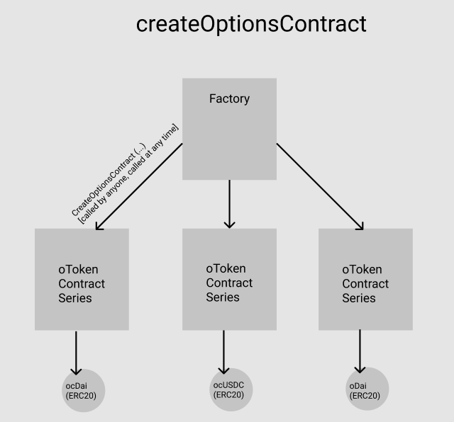

# Protocol Overview


**Insurance Buyers Quickstart:**

* [Buy oTokens](../optionsexchange-buy-and-sell-otokens.md#buy-otokens)
* [Calculate premiums to pay](../optionsexchange-buy-and-sell-otokens.md#calculate-premiums-to-pay)
* [Exercise ](../otoken.md#exercise)
* [oTokenExchangeRate](../otoken.md#otoken-exchange-rate)\*\*\*\*

**Insurance Sellers Quickstart:** 

* [Create and Sell oToken](../otoken.md#eth-collateralized-options-2)
* [Calculate premiums received](../optionsexchange-buy-and-sell-otokens.md#calculate-premiums-received)
* [Add Collateral](../otoken.md#add-eth-collateral)
* [Claim Collateral](../otoken.md#claim-collateral)


## Smart Contract Architecture 

### Options Factory

The OptionsFactory contract is used to create and keep track of the various options marketplaces. Each options marketplace is a new instantiation of the oToken contract. 

### oToken

Every option supported by the Convexity Protocol is integrated through an oToken smart contract. Options sellers create options by locking up collateral for some period of time and minting oTokens. Each oToken protects a unit of the specified underlying asset. The Options seller can sell these oTokens on an exchange to earn premiums. 

The main functionality offered by the oToken contract section is as below:

1. **Create Options \(oTokens\)** 

   To create oTokens, the insurance seller has to first open a [vault](glossary-of-terms.md), add collateral and then mint oTokens. 

2. **Keep the oToken vaults sufficiently collateralized**

   To ensure that the oToken contract has never sold more options than it can pay out, each individual account needs to have sufficient collateral to match the amount of options that the account has issued in its vault. Each vault needs to meet the [minimum collateralization requiremen](glossary-of-terms.md)[t.](glossary-of-terms.md)

3. **Liquidate undercollateralized vaults**

   Any vault that fails to meet the minimum collateralization requirements is subject to losing all or some of its collateral. Anyone can liquidate an undercollateralzed vault for a reward. 

4. **Exercise oTokens during the expiry window**

   oToken holders are allowed to exercise their option to sell their underlying tokens for the specified price at any time during the expiry window. 

### optionsExchange

The oTokens created can be bought and sold through the optionsExchange contract or directly on any exchange. The current implementation of the optionsExchange interface integrates with Uniswap for the purpose of buying and selling oTokens. The different Uniswap pools deployed for the purpose of insurance are oDai, ocDai and ocUSDC. 

